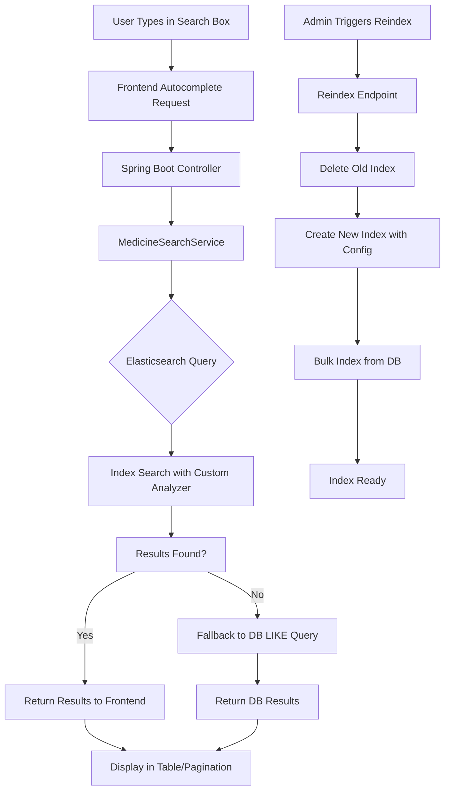

# Elasticsearch Production Implementation Guide

## Table of Contents

1. [Introduction](#introduction)
2. [Prerequisites](#prerequisites)
3. [Building Elasticsearch](#building-elasticsearch)
4. [Installation](#installation)
5. [Configuration](#configuration)
6. [Starting Elasticsearch](#starting-elasticsearch)
7. [Integration with Spring Boot Application](#integration-with-spring-boot-application)
8. [Control Flow System Diagram](#control-flow-system-diagram)
9. [Monitoring and Maintenance](#monitoring-and-maintenance)
10. [End-to-End Implementation Steps](#end-to-end-implementation-steps)
11. [Troubleshooting](#troubleshooting)
12. [Conclusion](#conclusion)

---

## Introduction

This document provides a comprehensive guide for implementing Elasticsearch in a production environment for the Pharmacy Management System (HMS). Elasticsearch is used for advanced search functionality, particularly for medicine autocomplete and search features. This guide covers building, installing, configuring, and maintaining Elasticsearch from start to finish, ensuring high availability, security, and performance in production.

### Purpose

- Standardize Elasticsearch implementation across the company.
- Ensure consistent setup for search functionality in HMS.
- Provide end-to-end guidance for production deployment.

### Scope

- Covers Elasticsearch 8.x (latest stable version).
- Focuses on Linux/Windows environments (adaptable).
- Includes integration with Spring Boot backend.

---

## Prerequisites

Before implementing Elasticsearch, ensure the following:

- **Hardware Requirements:**
  - Minimum: 2 CPU cores, 4GB RAM, 10GB disk space.
  - Recommended (Production): 4+ CPU cores, 16GB+ RAM, 100GB+ SSD storage.
  - For high-traffic: Scale based on data volume (e.g., 1TB+ for large medicine databases).

- **Software Requirements:**
  - Java 11 or higher (Elasticsearch requires JVM).
  - Maven 3.6+ (for building if needed).
  - Git (for cloning source if building from source).
  - Docker (optional, for containerized deployment).

- **Network Requirements:**
  - Open ports: 9200 (HTTP), 9300 (Transport).
  - Firewall rules for cluster communication.

- **Knowledge Prerequisites:**
  - Basic understanding of search engines and indexing.
  - Familiarity with Spring Boot and JPA.
  - Experience with Linux/Windows system administration.

---

## Local Development Setup

This section provides step-by-step instructions for setting up Elasticsearch locally on your Windows machine for development purposes, based on the HMS project setup.

### Step 1: Download Elasticsearch

1. Open your web browser and go to the official Elasticsearch download page: [https://www.elastic.co/downloads/elasticsearch](https://www.elastic.co/downloads/elasticsearch).
2. Select the latest stable version (e.g., 8.11.0 or higher).
3. Choose the Windows ZIP download option (e.g., `elasticsearch-8.11.0-windows-x86_64.zip`).
4. Click the download button and save the ZIP file to your desired location (e.g., `C:\Downloads` or your Desktop).

### Step 2: Extract the Downloaded File

1. Locate the downloaded ZIP file (e.g., `elasticsearch-8.11.0-windows-x86_64.zip`).
2. Right-click on the file and select "Extract All..." or use a tool like 7-Zip to extract it.
3. Choose an extraction location. For example, extract to `C:\elasticsearch` or a folder on your Desktop.
4. After extraction, you should have a folder like `C:\elasticsearch\elasticsearch-8.11.0`.

### Step 3: Navigate to the Bin Directory

1. Open File Explorer.
2. Go to the extracted Elasticsearch folder (e.g., `C:\elasticsearch\elasticsearch-8.11.0`).
3. Inside that folder, navigate to the `bin` subdirectory. The path should be something like `C:\elasticsearch\elasticsearch-8.11.0\bin`.

### Step 4: Open Command Prompt in the Bin Directory

1. In File Explorer, while in the `bin` folder, hold Shift and right-click in an empty space.
2. Select "Open PowerShell window here" or "Open command window here" from the context menu. This opens a Command Prompt (cmd) or PowerShell window directly in the `bin` directory.

### Step 5: Run Elasticsearch

1. In the Command Prompt window, type the following command and press Enter:
   ```
   elasticsearch.bat
   ```
2. Elasticsearch will start initializing. You should see output indicating it's starting up, such as:
   - Loading configuration
   - Starting nodes
   - Cluster status
3. Wait for the startup to complete. It may take 10-30 seconds.
4. Once started, you'll see logs indicating the node is up, such as:
   - Recovery of indices: `[INFO ][o.e.g.GatewayService] recovered [X] indices into cluster_state`
   - License status: `[INFO ][o.e.x.w.LicensedWriteLoadForecaster] license state changed, now [not valid]` (for free/basic license)
   - Health node selection: `[INFO ][o.e.h.n.s.HealthNodeTaskExecutor] Node [{node-name}] is selected as the current health node.`
   - Cluster health: `[INFO ][o.e.c.r.a.AllocationService] current.health="YELLOW" message="Cluster health status changed from [RED] to [YELLOW]"`

   **What these logs mean:**
   - **Recovered indices:** Elasticsearch is loading existing data/indexes from disk.
   - **License not valid:** Using the free/basic license; for production, consider a paid license.
   - **Health node:** The node is elected to monitor cluster health.
   - **Cluster health YELLOW:** All primary shards are allocated, but some replica shards are unassigned (normal for single-node setup). GREEN means fully healthy.

### Step 6: Verify Elasticsearch is Running

1. Open a web browser.
2. Go to `http://localhost:9200`.
3. You should see a JSON response with cluster information, confirming Elasticsearch is running.

### Step 7: Stop Elasticsearch (When Needed)

1. In the Command Prompt window where Elasticsearch is running, press `Ctrl + C` to stop it gracefully.
2. Alternatively, close the Command Prompt window to terminate the process.

### Additional Notes for Local Setup

- **Security:** By default, Elasticsearch 8.x has security enabled. On first run, it will generate passwords and certificates. Note them down securely.
- **Configuration:** For development, the default config in `config/elasticsearch.yml` is usually sufficient. You can edit it to disable security if needed (not recommended for production).
- **Integration with HMS:** Once running, your Spring Boot app can connect to `http://localhost:9200`. Ensure your `application.properties` has `spring.elasticsearch.uris=http://localhost:9200`.
- **Troubleshooting:** If it fails to start, check Java installation (`java -version`) and ensure ports 9200/9300 are free.
- **Persistence:** Data is stored in `data` folder within the Elasticsearch directory. For development, this is fine; for production, use dedicated paths.

This local setup is quick for development and testing the HMS search features.

---

## Building Elasticsearch

Elasticsearch can be built from source for custom modifications or to ensure compatibility. However, for production, use official binaries unless customization is required.

### Steps to Build from Source (Optional)

1. **Clone the Repository:**

   ```
   git clone https://github.com/elastic/elasticsearch.git
   cd elasticsearch
   ```

2. **Checkout a Stable Tag:**

   ```
   git checkout v8.11.0  # Replace with latest stable version
   ```

3. **Build with Gradle:**

   ```
   ./gradlew assemble
   ```

4. **Create Distribution:**

   ```
   ./gradlew :distribution:archives:linux-tar:assemble
   ```

5. **Extract and Verify:**
   - Extract the tar.gz file from `distribution/archives/linux-tar/build/distributions/`.
   - Verify with `./bin/elasticsearch --version`.

**Note:** Building from source is time-consuming (30-60 minutes) and requires significant resources. For production, download pre-built binaries from elastic.co.

---

## Installation

### Option 1: Download and Install Binaries (Recommended for Production)

1. **Download Elasticsearch:**
   - Visit [elastic.co/downloads/elasticsearch](https://www.elastic.co/downloads/elasticsearch).
   - Download the ZIP/TAR for your OS (e.g., elasticsearch-8.11.0-windows-x86_64.zip).

2. **Extract to Directory:**

   ```
   unzip elasticsearch-8.11.0-windows-x86_64.zip
   cd elasticsearch-8.11.0
   ```

3. **Set Environment Variables:**
   - Add `ES_HOME` to system PATH.
   - Set `JAVA_HOME` if not already set.

### Basic Configuration

```yaml
# Cluster and Node Settings
cluster.name: hms-elasticsearch-cluster
node.name: hms-node-1
path.data: /var/lib/elasticsearch/data
path.logs: /var/lib/elasticsearch/logs

# Network Settings
network.host: 0.0.0.0
http.port: 9200

# Discovery (Single Node for Small Deployments)
discovery.type: single-node

# Security (Enable in Production)
xpack.security.enabled: true
xpack.security.transport.ssl.enabled: true
xpack.security.http.ssl.enabled: true

# Memory Settings (in jvm.options)
-Xms4g
-Xmx4g
```

### Custom Analyzers for HMS (Based on Project Config)

For medicine search, configure custom analyzers in `elasticsearch.yml` or via API:

```yaml
analysis:
  char_filter:
    smart_quotes:
      type: mapping
      mappings:
        - '“ => "'
        - '” => "'
        - "‘ => '"
        - "’ => '"
  analyzer:
    autocomplete_index:
      type: custom
      tokenizer: standard
      filter: [lowercase, word_delimiter, edge_ngram]
      char_filter: [smart_quotes]
    autocomplete_search:
      type: custom
      tokenizer: standard
      filter: [lowercase, word_delimiter]
      char_filter: [smart_quotes]
  filter:
    edge_ngram:
      type: edge_ngram
      min_gram: 1
      max_gram: 20
```

This handles special characters, punctuation, and enables prefix matching (e.g., "S" matches "'S' Nut").

### Production-Specific Settings

- Enable TLS/SSL for transport and HTTP.
- Configure authentication (basic auth or API keys).
- Set up cluster with multiple nodes for HA.
- Configure backups and snapshots.

---

## Starting Elasticsearch

### Starting from Binaries

1. **Navigate to Installation Directory:**

   ```
   cd /path/to/elasticsearch
   ```

2. **Start Elasticsearch:**

   ```
   ./bin/elasticsearch
   ```

3. **Run in Background (Production):**

   ```
   nohup ./bin/elasticsearch > /dev/null 2>&1 &
   ```

4. **Verify Startup:**
   - Check logs: `tail -f logs/elasticsearch.log`
   - Test API: `curl -X GET "localhost:9200"`

### Starting with Docker

```
docker start elasticsearch
```

### Startup Options

- **Foreground:** `./bin/elasticsearch` (for debugging).
- **Daemon:** `./bin/elasticsearch -d` (background).
- **Custom Config:** `./bin/elasticsearch -E path.conf=/custom/config`

---

## Integration with Spring Boot Application

In the HMS project, Elasticsearch is integrated via Spring Data Elasticsearch.

### Key Components

1. **Configuration Class:** `MedicineSearchIndexConfig.java`
   - Defines index settings, mappings, and analyzers.
   - Example: Creates "medicines" index with custom analyzers.

2. **Entity:** `Medicine.java`
   - JPA entity with `@Document(indexName = "medicines")`.
   - Fields: name, medicineCode, isActive, etc.

3. **Repository:** `MedicineRepository.java`
   - Extends `ElasticsearchRepository<Medicine, String>`.

4. **Service:** `MedicineSearchService.java`
   - Handles search queries with bool queries, fuzzy matching, and fallbacks to DB.

### Integration Steps

1. Add Dependencies in `pom.xml`:

   ```xml
   <dependency>
       <groupId>org.springframework.data</groupId>
       <artifactId>spring-data-elasticsearch</artifactId>
   </dependency>
   ```

2. Configure in `application.properties`:

   ```
   spring.elasticsearch.uris=http://localhost:9200
   ```

3. Index Creation on Startup:
   - Use `@PostConstruct` in config to create index if not exists.

4. Data Seeding:
   - Use `MedicineSeeder.java` to load from CSV and index in ES.

---

## Control Flow System Diagram

Below is a Mermaid diagram illustrating the control flow for Elasticsearch in the HMS system.



This diagram shows the end-to-end flow from user input to search results, including reindexing.

## Monitoring and Maintenance

### Monitoring Tools

- **Built-in:** `_cluster/health`, `_cat/nodes`.
- **External:** ELK Stack (Elasticsearch, Logstash, Kibana) for visualization.

### Commands

- Health Check: `curl -X GET "localhost:9200/_cluster/health?pretty"`
- Index Stats: `curl -X GET "localhost:9200/medicines/_stats?pretty"`

---

## End-to-End Implementation Steps

1. **Planning:**
   - Assess data volume and search requirements.
   - Design index mappings and analyzers.

2. **Setup:**
   - Install Elasticsearch as per above.
   - Configure for production.

3. **Integration:**
   - Add ES dependencies to Spring Boot.
   - Implement config, entities, services.

4. **Deployment:**
   - Deploy ES cluster.
   - Deploy application with ES integration.

5. **Go-Live:**
   - Seed data and reindex.
   - Monitor performance.

---

## Troubleshooting

- **Common Issues:**
  - Port conflicts: Change ports in config.
  - Memory errors: Adjust JVM settings.
  - Search not matching: Check analyzer tokenization with `_analyze` API.

- **Logs:** Check `logs/elasticsearch.log` for errors.

- **Support:** Refer to [elastic.co/support](https://www.elastic.co/support).

---

## Conclusion

This guide ensures a standardized, production-ready implementation of Elasticsearch for the HMS project. Follow the steps sequentially for successful deployment. For updates or customizations, refer to the official Elasticsearch documentation.

---

_This document is a living standard. Update as needed for new versions or requirements._
