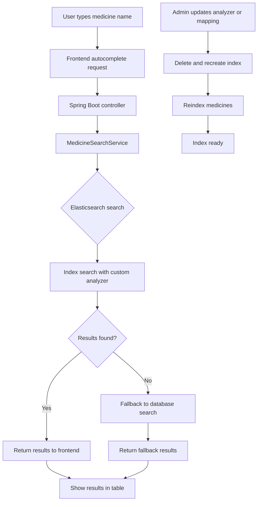

# Elasticsearch Production Implementation Guide

## Purpose

This document explains how Elasticsearch is installed, started, configured, and integrated in the HMS project. It is written so a new developer can set it up locally and understand how to move the same setup toward production.

## What Elasticsearch Is Used For

- Medicine search and autocomplete.
- Prefix matching for partial medicine names.
- Better handling of punctuation, quotes, and compound names.
- Fast search fallback when the database query would be too slow..

## Prerequisites

Before you start, install or confirm the following:

- Windows 10 or later.
- Java 17 or the version required by the Elasticsearch release you download.
- A browser and access to the internet for downloading Elasticsearch.
- Maven for the backend project.
- Node.js and Angular CLI if you also want to run the frontend.

## Local Installation Steps on Windows

This is the exact flow used in the HMS project for local development.

### 1. Download Elasticsearch

1. Open the official download page: https://www.elastic.co/downloads/elasticsearch.
2. Download the Windows ZIP version.
3. Save the file somewhere simple, for example `C:\Downloads` or your Desktop.

### 2. Extract the ZIP file

1. Right-click the downloaded ZIP file.
2. Select `Extract All` or use 7-Zip.
3. Extract it to a folder such as `C:\elasticsearch`.
4. After extraction, you should see a folder like `C:\elasticsearch\elasticsearch-8.x.x`.

### 3. Open the `bin` folder

1. Open the extracted Elasticsearch folder.
2. Go into the `bin` folder.
3. The path should look like `C:\elasticsearch\elasticsearch-8.x.x\bin`.

### 4. Open Command Prompt in that folder

1. Click the address bar in File Explorer and type `cmd`, then press Enter.
2. Or hold `Shift` and right-click inside the folder, then open Command Prompt or PowerShell.

### 5. Start Elasticsearch

Run this command from the `bin` folder:

```bat
elasticsearch.bat
```

What happens after that:

- Elasticsearch loads its configuration.
- It starts the node process.
- It recovers existing indices if data already exists.
- It opens the HTTP port, usually `9200`.

### 6. Check the startup output

You will usually see logs similar to these:

```text
[INFO ][o.e.g.GatewayService] recovered [6] indices into cluster_state
[INFO ][o.e.h.n.s.HealthNodeTaskExecutor] Node [ARTEM] is selected as the current health node.
[INFO ][o.e.c.r.a.AllocationService] current.health="YELLOW" message="Cluster health status changed from [RED] to [YELLOW]"
```

What those logs mean:

- `recovered [6] indices` means Elasticsearch loaded data from disk.
- `current health node` means the node is active and managing cluster health.
- `YELLOW` is normal for a single-node setup because replicas are not assigned.

### 7. Verify Elasticsearch is running

Open a browser and go to:

```text
http://localhost:9200
```

If Elasticsearch is running, you should see a JSON response with cluster details.

### 8. Stop Elasticsearch

When you want to stop it:

1. Go back to the Command Prompt window.
2. Press `Ctrl + C`.
3. Wait for the process to stop cleanly.

## Project Configuration in HMS

The HMS project connects Spring Boot to Elasticsearch using Spring Data Elasticsearch.

### Main files involved

- `backend/src/main/java/com/hms/pharmacy/config/MedicineSearchIndexConfig.java`
- `backend/src/main/java/com/hms/pharmacy/entity/Medicine.java`
- `backend/src/main/java/com/hms/pharmacy/repository/MedicineRepository.java`
- `backend/src/main/java/com/hms/pharmacy/service/search/MedicineSearchService.java`

### What each file does

- `MedicineSearchIndexConfig.java` creates the index and defines analyzers.
- `Medicine.java` stores the medicine fields that are indexed.
- `MedicineRepository.java` gives repository access for search and indexing.
- `MedicineSearchService.java` runs search queries and handles fallback logic.

## Elasticsearch Settings Used by HMS

The HMS implementation uses custom analyzers so search can handle medicine names with punctuation, quotes, and short prefixes.

```yaml
analysis:
  char_filter:
    smart_quotes:
      type: mapping
      mappings:
        - '“ => "'
        - '” => "'
        - "‘ => '"
        - "’ => '"
  analyzer:
    autocomplete_index:
      type: custom
      tokenizer: standard
      filter: [lowercase, word_delimiter, edge_ngram]
      char_filter: [smart_quotes]
    autocomplete_search:
      type: custom
      tokenizer: standard
      filter: [lowercase, word_delimiter]
      char_filter: [smart_quotes]
  filter:
    edge_ngram:
      type: edge_ngram
      min_gram: 1
      max_gram: 20
```

Why this matters:

- `standard` tokenizer handles normal word splitting.
- `word_delimiter` helps with compound medicine names.
- `edge_ngram` lets search match short prefixes like `S`.
- `smart_quotes` normalizes curly quotes to plain quotes.

## Control Flow



## End-to-End Flow for New Developers

1. Download and extract Elasticsearch.
2. Start Elasticsearch with `elasticsearch.bat` from the `bin` folder.
3. Confirm `http://localhost:9200` is responding.
4. Start the backend Spring Boot application.
5. Open the frontend application.
6. Search for medicines and confirm autocomplete works.
7. If analyzer changes are made, delete and recreate the index, then reindex the data.

## Production Checklist

- Enable security and TLS.
- Use a proper cluster, not only a single local node.
- Set heap memory according to available RAM.
- Back up indices with snapshots.
- Monitor logs, cluster health, and disk usage.
- Reindex after changing analyzers or mappings.

## Common Startup Output and Meaning

- `recovered [X] indices` means old data was loaded successfully.
- `current health node` means the node is active.
- `YELLOW` means the cluster is usable, but replicas are not assigned.
- `GREEN` means all primaries and replicas are healthy.

## Troubleshooting

- If Elasticsearch does not start, check Java first.
- If port `9200` is already in use, stop the conflicting process.
- If search results are missing, verify the index mapping and analyzer.
- If you change search settings, reindex the data.

## Summary

For local development on Windows, the key steps are: download Elasticsearch, extract the ZIP, open the `bin` folder, run `elasticsearch.bat`, then verify `http://localhost:9200`. After that, connect the HMS backend to Elasticsearch and reindex the medicine data.
