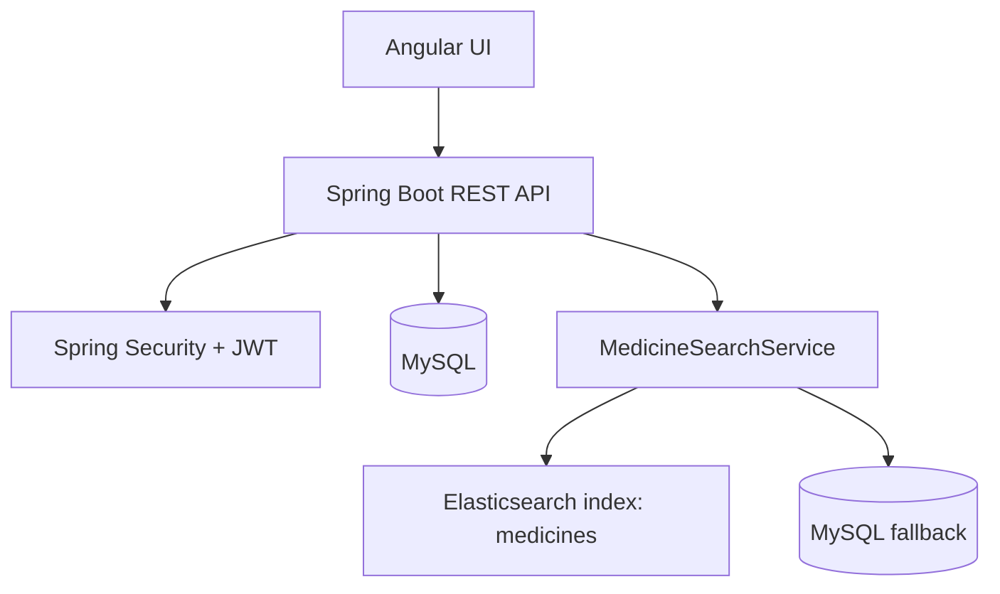
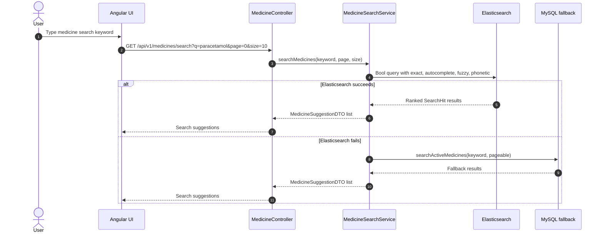
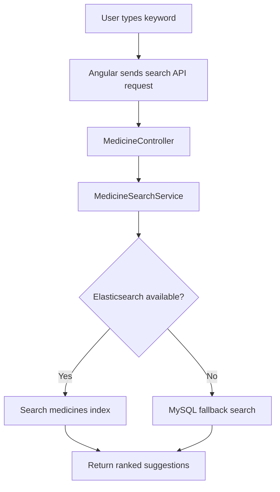
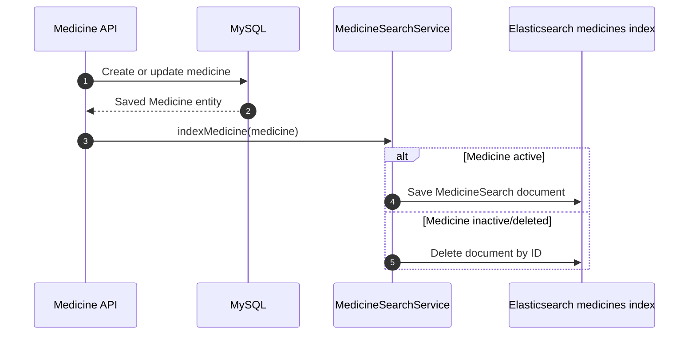
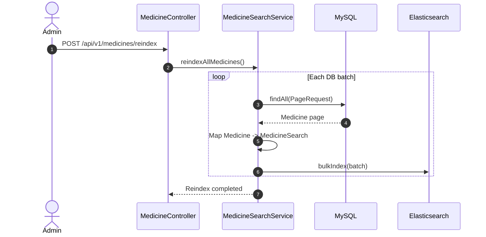

# Artem Health HMS

A Spring Boot and Angular Hospital Management System with patient management, appointments, prescriptions, billing, pharmacy inventory, and Elasticsearch-backed medicine search.

The backend keeps MySQL as the source of truth and uses Elasticsearch as a fast search index for autocomplete, fuzzy matching, ranking, and resilient medicine lookup.

## Tech Stack

| Layer    | Technology                                                        |
| -------- | ----------------------------------------------------------------- |
| Frontend | Angular 17, RxJS, PrimeNG                                         |
| Backend  | Spring Boot 3.3, Spring Security, Spring Data JPA                 |
| Database | MySQL                                                             |
| Search   | Elasticsearch 8, Spring Data Elasticsearch                        |
| Auth     | JWT access token, refresh token cookie, role-based access control |
| Mapping  | MapStruct, Lombok                                                 |

## System Architecture



## Elasticsearch Search

### 1. Introduction

Elasticsearch is a distributed search and analytics engine built on Apache Lucene. It is designed for fast, scalable, and intelligent search.

Simple idea:

```text
MySQL          -> stores the real business data
Elasticsearch -> finds indexed data quickly and intelligently
```

MySQL is strongest at transactions, joins, constraints, and exact record lookup. Elasticsearch is strongest at full-text search, autocomplete, typo tolerance, ranking, filtering, and relevance scoring.

In this project, MySQL remains the source of truth. Elasticsearch stores a search-optimized copy of medicine data.

### 2. MySQL vs Elasticsearch

| Aspect         | MySQL                                      | Elasticsearch                     |
| -------------- | ------------------------------------------ | --------------------------------- |
| Type           | Relational database                        | Search and analytics engine       |
| Storage model  | Tables, rows, columns                      | Indexes, JSON documents, fields   |
| Query language | SQL                                        | Query DSL, JSON based             |
| Search style   | Exact lookup, `LIKE`                       | Full-text, fuzzy, ranked          |
| Scaling        | Mostly vertical, can be replicated/sharded | Horizontal by design              |
| Best use       | Transactions and structured persistence    | Fast search and relevance ranking |
| Schema         | Fixed schema                               | Mapping                           |
| Search speed   | Can be slow for text search at scale       | Fast through inverted indexes     |

| MySQL Concept   | Elasticsearch Concept |
| --------------- | --------------------- |
| Database/server | Cluster               |
| Table           | Index                 |
| Row/record      | Document              |
| Column          | Field                 |
| Schema          | Mapping               |
| SQL query       | Query DSL             |

### 3. Cluster Concepts

An Elasticsearch cluster is a group of nodes.

| Concept  | Meaning                           | Purpose                              |
| -------- | --------------------------------- | ------------------------------------ |
| Cluster  | Group of Elasticsearch nodes      | Coordinates storage and search       |
| Node     | One server/process in the cluster | Stores data and executes queries     |
| Index    | Collection of similar documents   | Similar to a table                   |
| Shard    | Partition of an index             | Scale data and search workload       |
| Replica  | Copy of a shard                   | Fault tolerance and read performance |
| Document | One JSON object                   | One searchable record                |
| Field    | Property inside a document        | Searchable or filterable value       |

Flow:

```text
Cluster -> Index -> Shard -> Document -> Field
```

### 4. Core Search Terms

| Term     | Explanation                                               |
| -------- | --------------------------------------------------------- |
| Document | One JSON object stored in Elasticsearch                   |
| Field    | One property inside a document, such as `name` or `stock` |
| Index    | A collection of similar documents, such as medicines      |
| Token    | A piece of text created during analysis                   |
| Term     | The final indexed value Elasticsearch actually searches   |
| Mapping  | Rules for how each field is indexed and searched          |
| Analyzer | Pipeline that converts raw text into searchable terms     |

Example document:

```json
{
  "id": 1,
  "name": "Paracetamol 500mg",
  "brand": "SunFarma",
  "stock": 120,
  "isActive": true
}
```

### 5. Inverted Index

Elasticsearch does not search text by scanning every document. It builds an inverted index.

Documents:

```text
Doc1: Paracetamol for fever
Doc2: Ibuprofen for pain
```

Inverted index:

| Term        | Matching documents |
| ----------- | ------------------ |
| paracetamol | Doc1               |
| fever       | Doc1               |
| ibuprofen   | Doc2               |
| pain        | Doc2               |

This makes text search fast because Elasticsearch can jump from a term to matching document IDs.

### 6. Indexing Pipeline

Input:

```text
Paracetamol 500mg for Fever
```

Pipeline:


Example output:

```text
Raw text     : Paracetamol 500mg for Fever
Tokenizer    : ["Paracetamol", "500mg", "for", "Fever"]
Lowercase    : ["paracetamol", "500mg", "for", "fever"]
Final terms  : indexed terms used during search
```

If no analyzer is configured on a `text` field, Elasticsearch uses the standard analyzer.

### 7. Query Execution

User search:

```text
Paracetamol 500
```

Execution flow:



Search steps:

1. Query text is analyzed.
2. Tokens are created.
3. Matching documents are fetched from the inverted index.
4. BM25 scoring ranks results.
5. Top results are returned.

### 8. BM25 Scoring

BM25 decides which document is most relevant.

| Scoring Part                    | Meaning                                        |
| ------------------------------- | ---------------------------------------------- |
| TF, term frequency              | How often a term appears in a document         |
| IDF, inverse document frequency | How rare the term is across all documents      |
| Length normalization            | Prevents long documents from unfairly winning  |
| Boost                           | Manual weight added to important query clauses |

This project uses boosts for search behavior:

| Match Type   | Field           | Purpose                     | Boost |
| ------------ | --------------- | --------------------------- | ----- |
| Exact phrase | `name`          | Prefer exact medicine names | `4.0` |
| Autocomplete | `name.auto`     | Prefix and partial typing   | `3.0` |
| Fuzzy        | `name`          | Typo tolerance              | `2.0` |
| Phonetic     | `name.phonetic` | Sound-alike matching        | `1.5` |

### 9. Medicine Search Index Design

The application uses a single Elasticsearch index:

```text
Application -> medicines index
```

Current search document:

| Field           | Type    | Purpose                                 |
| --------------- | ------- | --------------------------------------- |
| `id`            | ID      | Matches the MySQL medicine ID           |
| `name`          | Text    | Standard full-text search               |
| `name.keyword`  | Keyword | Exact aggregation/sorting capable field |
| `name.auto`     | Text    | Autocomplete analyzer                   |
| `name.phonetic` | Text    | Double metaphone phonetic analyzer      |
| `brand`         | Keyword | Manufacturer/brand display              |
| `stock`         | Integer | Stock display and future scoring        |
| `isActive`      | Boolean | Filter inactive medicines               |

### 10. Mapping Change Strategy

Elasticsearch does not allow major mapping changes on existing fields. Examples:

| Change                                | Allowed on existing field? |
| ------------------------------------- | -------------------------- |
| Add a new field                       | Usually yes                |
| Change field type                     | No                         |
| Change analyzer for an existing field | No                         |
| Change keyword to text                | No                         |

For local development, delete and recreate the `medicines` index after mapping or analyzer changes, then run the reindex endpoint to rebuild documents from MySQL.

### 11. Local Development Setup

Run Elasticsearch locally:

```powershell
docker run -d --name es -p 9200:9200 -p 9300:9300 -e "discovery.type=single-node" -e "xpack.security.enabled=false" docker.elastic.co/elasticsearch/elasticsearch:8.13.0
```

Test:

```bash
curl http://localhost:9200
```

Important for phonetic search:

```powershell
docker exec es bin/elasticsearch-plugin install analysis-phonetic
docker restart es
```

The `name.phonetic` field uses the Elasticsearch phonetic token filter. Install the `analysis-phonetic` plugin before the application creates the index.

### 12. Spring Boot Configuration

Dependency:

```xml
<dependency>
    <groupId>org.springframework.boot</groupId>
    <artifactId>spring-boot-starter-data-elasticsearch</artifactId>
</dependency>
```

Application properties:

```properties
spring.elasticsearch.uris=http://localhost:9200
spring.elasticsearch.socket-timeout=60s
spring.elasticsearch.connection-timeout=5s
```

What Spring Data Elasticsearch provides:

| Feature            | Purpose                                   |
| ------------------ | ----------------------------------------- |
| Java client        | Talks to Elasticsearch                    |
| Repository support | `ElasticsearchRepository` for CRUD        |
| Document mapping   | Maps Java classes to JSON documents       |
| Query DSL support  | Builds full-text, fuzzy, phonetic queries |
| Index operations   | Creates mappings and settings             |
| Bulk operations    | Efficient batch indexing                  |

### 13. Current Implementation Files

| File                             | Responsibility                            |
| -------------------------------- | ----------------------------------------- |
| `MedicineSearch.java`            | Elasticsearch document mapping            |
| `MedicineSearchIndexConfig.java` | Index settings, analyzers, and mapping    |
| `MedicineSearchRepository.java`  | Spring Data Elasticsearch repository      |
| `MedicineSearchService.java`     | Search query, fallback, indexing, reindex |
| `MedicineController.java`        | Search and reindex API endpoints          |
| `MedicineRepository.java`        | MySQL fallback query                      |

### 14. Current Search Flow



### 15. Index Synchronization Flow



### 16. Reindex Flow



### 17. Reindex Plan

Current implementation creates the `medicines` index directly.

For a mapping or analyzer change:

| Step | Action                                             |
| ---- | -------------------------------------------------- |
| 1    | Stop writes that update the search index           |
| 2    | Delete the existing `medicines` index              |
| 3    | Restart the backend so index settings are recreated |
| 4    | Run the reindex endpoint to rebuild from MySQL     |
| 5    | Validate search quality                            |

### 18. API Endpoints

| Endpoint                                              | Method | Purpose                                |
| ----------------------------------------------------- | ------ | -------------------------------------- |
| `/api/v1/medicines/search?q={keyword}&page=0&size=10` | GET    | Search medicine suggestions            |
| `/api/v1/medicines/reindex`                           | POST   | Rebuild Elasticsearch index from MySQL |
| `/api/v1/medicines/active`                            | GET    | Get active medicines with fallback     |

### 19. Production Checklist

| Item            | Recommendation                                             |
| --------------- | ---------------------------------------------------------- |
| Source of truth | Keep MySQL as source of truth                              |
| Search index    | Treat Elasticsearch as rebuildable                         |
| Mapping changes | Recreate the search index and reindex from MySQL           |
| Reindexing      | Use batches and bulk API                                   |
| Fallback        | Keep MySQL fallback for degraded mode                      |
| Plugin          | Install `analysis-phonetic` before using phonetic analyzer |
| Tests           | Add integration tests for analyzers and ranking            |
| Rollback        | Keep old index until new version is verified               |

## Getting Started

### Prerequisites

| Tool          | Version                                |
| ------------- | -------------------------------------- |
| JDK           | 17+                                    |
| Node.js       | 18+                                    |
| Maven         | Wrapper included in `backend/mvnw.cmd` |
| MySQL         | 8+                                     |
| Elasticsearch | 8.x                                    |

### Backend

```powershell
cd backend
$env:JAVA_HOME='C:\Users\Piyush\.jdks\ms-17.0.18'
.\mvnw.cmd spring-boot:run
```

### Frontend

```powershell
cd frontend
npm install
npm start
```

Open:

```text
http://localhost:4200
```

## Reliability Notes

| Concern           | Current approach                   |
| ----------------- | ---------------------------------- |
| Authentication    | JWT with refresh token handling    |
| Authorization     | Role-based method and route access |
| Search outage     | MySQL fallback path                |
| Index rebuild     | Admin reindex endpoint             |
| Mapping migration | Recreate and reindex Elasticsearch |
| Data integrity    | MySQL remains source of truth      |
