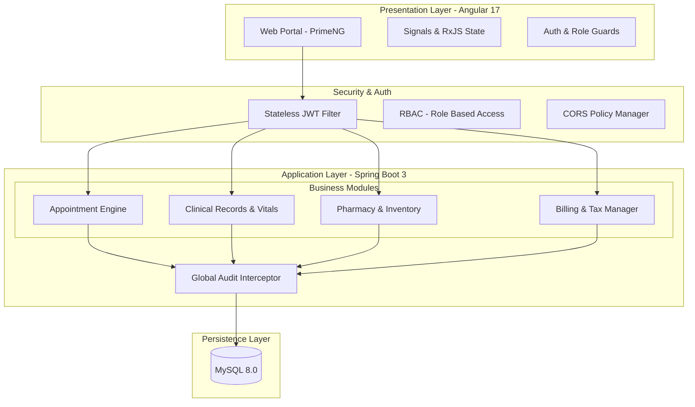

# 🏥 Artem Health HMS - Unified Healthcare Platform

A medical-grade Hospital Management System (HMS) designed for modern healthcare environments. Built on a robust **Spring Boot 3** backend and a responsive **Angular 17** frontend, it streamlines clinical workflows, patient management, and financial operations.

---

## 🏗️ System Architecture

The platform follows a modular monolith pattern, ensuring clear separation of concerns and maintainable business logic.



---

## 🌟 Core Features

### 🏥 Clinical & Patient Management

- **Patient Directory**: Comprehensive demographic tracking with urgency-level triage.
- **Vitals Tracking**: Historical clinical records for BP, SpO2, Pulse, and Temperature.
- **Digital Prescriptions**: Professional Rx generation with automated medication lookups.
- **Print-Ready Reports**: High-quality PDF/Print views for prescriptions and clinical records.

### 💰 Revenue & Billing

- **Automated Billing**: Instant invoice generation from appointments and prescriptions.
- **Tax Integration**: Automated GST/Tax calculation for healthcare services.
- **Financial Exports**: Audit-ready Excel/CSV exports for all financial data.

### 💊 Pharmacy & Supply Chain

- **Medicine Inventory**: Real-time stock tracking with low-stock alerts.
- **Dispense Workflow**: Integrated dispensing logic linked to patient prescriptions.

---

## 🛠️ Tech Stack

| Layer         | Technology                                     |
| :------------ | :--------------------------------------------- |
| **Frontend**  | Angular 17 (Standalone), PrimeNG, RxJS         |
| **Backend**   | Spring Boot 3.3, Spring Data JPA, Lombok       |
| **Security**  | Spring Security 6, JWT (Stateless)             |
| **Database**  | MySQL 8.0 / H2 (Development)                   |
| **Reporting** | XLSX (Excel Export), CSS Media Print (Reports) |

---

## 🚦 Getting Started

### Prerequisites

- **JDK 17+**
- **Node.js 18+** (LTS)
- **Maven 3.8+**
- **MySQL 8.0**

### Quick Setup

1.  **Database Setup**:
    - Create a database named `hms_db`.
    - Update `backend/src/main/resources/application-mysql.properties` with your credentials.

2.  **Start Backend**:

    ```bash
    cd backend
    mvn spring-boot:run
    ```

3.  **Start Frontend**:
    ```bash
    cd frontend
    npm install
    npm start
    ```
    Access the app at `http://localhost:4200`.

## 🔒 Reliability & Standards

- **Audit Trail**: Automated tracking of `createdAt` and `updatedBy` for all clinical records.
- **Soft Deletion**: Critical medical data uses a `deleted` flag to maintain a permanent audit history.
- **RBAC**: Strict Role-Based Access Control enforced at both Frontend and API levels.
- **Production Hardened**: Centralized error handling and interceptors for consistent API communication.
