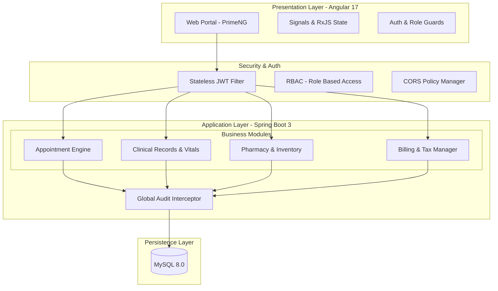

# 🏥 Artem Health HMS - Unified Healthcare Platform

A medical-grade Hospital Management System (HMS) designed for modern healthcare environments. Built on a robust **Spring Boot 3** backend and a responsive **Angular 17** frontend, it streamlines clinical workflows, patient management, and financial operations.

---

## 🏗️ System Architecture

The platform follows a modular monolith pattern, ensuring clear separation of concerns and maintainable business logic.



---

## 🔁 In-Depth Sequence Diagrams

### 🔐 JWT Authentication Flow (Login, Protected API, Refresh, Logout)

```mermaid
sequenceDiagram
    autonumber
    actor User as User (Browser)
    participant UI as Angular UI
    participant JI as jwt.interceptor.ts
    participant API as AuthController
    participant AS as AuthServiceImpl
    participant AM as AuthenticationManager
    participant UDS as CustomUserDetailsService
    participant UR as UserRepository
    participant JU as JwtUtil
    participant CU as CookieUtil
    participant RF as JwtAuthenticationFilter
    participant SEC as SecurityContextHolder
    participant RR as RevokedRefreshTokenRepository

    rect rgb(235, 248, 255)
        Note over User,CU: 1) Login
        User->>UI: Enter username/password
        UI->>API: POST /api/v1/auth/login (withCredentials=true)
        API->>AS: login(LoginRequest)
        AS->>AM: authenticate(UsernamePasswordAuthenticationToken)
        AM->>UDS: loadUserByUsername(username/email)
        UDS->>UR: findByUsername or findByEmail
        UR-->>UDS: User
        UDS-->>AM: UserDetails (User entity)
        AM-->>AS: Authentication success
        AS->>UR: findByUsername or findByEmail
        UR-->>AS: User
        AS->>JU: generateAccessToken(username, role, tokenVersion)
        AS->>JU: generateRefreshToken(username, tokenVersion)
        JU-->>AS: signed JWTs (HS256)
        AS-->>API: AuthResponse {token, refreshToken, role, ...}
        API->>CU: setRefreshTokenCookie(response, refreshToken)
        CU-->>User: HttpOnly refreshToken cookie (SameSite from config)
        API-->>UI: ApiResponse<AuthResponse> with access token
        UI->>UI: storeSession() -> keep access token in memory
    end

    rect rgb(240, 255, 244)
        Note over User,SEC: 2) Protected API call with access token
        User->>UI: Open protected screen
        UI->>JI: outgoing request
        JI->>JI: Attach Authorization: Bearer <accessToken>
        JI->>RF: Request reaches backend security chain
        RF->>RF: Read Authorization header
        alt Missing or non-Bearer token
            RF-->>RF: Skip authentication; continue filter chain
        else Bearer token present
            RF->>JU: validateToken(jwt)
            alt JWT invalid/expired
                RF-->>RF: Continue without authentication
            else JWT valid
                RF->>JU: extractTokenType(jwt)
                alt Token type is REFRESH
                    RF-->>RF: Reject as auth context; continue chain
                else Token type is ACCESS
                    RF->>JU: extractUsername(jwt)
                    RF->>UDS: loadUserByUsername(username)
                    UDS->>UR: fetch user
                    UR-->>UDS: User
                    RF->>JU: extractTokenVersion(jwt)
                    alt tokenVersion mismatch (stale/revoked)
                        RF-->>RF: Continue without auth
                    else tokenVersion valid
                        RF->>SEC: setAuthentication(UsernamePasswordAuthenticationToken)
                    end
                end
            end
        end
        SEC-->>UI: Authorized response for role-allowed endpoint
    end

    rect rgb(255, 250, 240)
        Note over UI,RR: 3) Auto refresh when access token expires (401)
        UI->>JI: Protected call returns 401
        JI->>JI: if not /auth/login,/auth/refresh and not retried
        JI->>API: POST /api/v1/auth/refresh (withCredentials=true)
        API->>CU: getRefreshToken(request)
        CU-->>API: refreshToken from cookie
        API->>AS: refreshToken(TokenRefreshRequest)
        AS->>JU: validateToken(refreshToken)
        AS->>RR: existsByTokenHash(hashToken(refreshToken))
        RR-->>AS: revoked? false
        AS->>JU: extractUsername + extractTokenVersion
        AS->>UR: findByUsername(username)
        UR-->>AS: User
        AS->>AS: compare DB tokenVersion vs JWT tokenVersion
        alt Valid refresh token and version
            AS->>JU: generate new access + refresh token
            AS-->>API: new AuthResponse
            API->>CU: setRefreshTokenCookie(newRefreshToken)
            API-->>JI: ApiResponse<AuthResponse>
            JI->>JI: store new access token
            JI->>API: Retry original request with X-Auth-Retry=true
            API-->>UI: Successful retried response
        else Invalid/revoked/version mismatch
            AS-->>API: InvalidCredentialsException
            API-->>JI: 401
            JI->>UI: logout(false) + route to login
        end
    end

    rect rgb(255, 245, 245)
        Note over User,RR: 4) Logout and token revocation
        User->>UI: Click Logout
        UI->>API: POST /api/v1/auth/logout
        API->>CU: getRefreshToken(cookie)
        API->>AS: logout(username, refreshToken)
        AS->>UR: findByUsername(username)
        UR-->>AS: User
        AS->>AS: tokenVersion = tokenVersion + 1 (instant access token revocation)
        AS->>JU: validateToken(refreshToken)
        AS->>JU: hashToken(refreshToken)
        AS->>RR: save revoked refresh token hash (if not already revoked)
        API->>CU: clearAuthCookies()
        API-->>UI: Logged out successfully
        UI->>UI: clear access token + clear user state
    end
```

### 🔎 Elasticsearch Flow (Autocomplete Search, Indexing, Reindex, Fallback)

```mermaid
sequenceDiagram
    autonumber
    actor User as User (Pharmacist/Doctor/Nurse/Admin)
    participant PUI as Angular Search UI
    participant MS as medicine-search.service.ts / prescription.service.ts
    participant JI as jwt.interceptor.ts
    participant MC as MedicineController / PrescriptionController
    participant MSE as MedicineSearchService
    participant EO as ElasticsearchOperations
    participant ESR as MedicineSearchRepository
    participant MR as MedicineRepository (MySQL)
    participant IDX as MedicineSearchIndexConfig

    rect rgb(236, 253, 245)
        Note over User,MR: A) Runtime medicine search request
        User->>PUI: Type medicine keyword
        PUI->>PUI: debounceTime(300) + distinctUntilChanged
        alt Pharmacy module
            PUI->>MS: GET /api/v1/medicines/search?q=<keyword>
        else Prescription module
            PUI->>MS: GET /api/v1/prescriptions/medicines/search?q=<keyword>
        end
        MS->>JI: HTTP request
        JI->>MC: Adds Bearer access token + withCredentials
        MC->>MSE: searchMedicines(keyword)
        MSE->>MSE: Validate non-blank query
        MSE->>MSE: Build phonetic codes (DoubleMetaphone)
        MSE->>EO: NativeQuery bool must+should
        Note over MSE,EO: should: exact name match (boost 3.0) + fuzzy AUTO (boost 2.0) + phoneticCodes terms; filter isActive=true; size=10
        alt Elasticsearch available
            EO-->>MSE: SearchHit<MedicineSearch>
            MSE->>MSE: Map to MedicineSuggestionDTO
            MSE-->>MC: top 10 suggestions
            MC-->>PUI: ApiResponse success
            PUI->>PUI: Show dropdown suggestions and highlight matches
        else Elasticsearch unavailable/error
            MSE->>MR: searchActiveMedicines(query, PageRequest.of(0,10))
            MR-->>MSE: DB fallback results
            MSE-->>MC: fallback suggestions
            MC-->>PUI: ApiResponse success (degraded mode)
        end
    end

    rect rgb(239, 246, 255)
        Note over MC,ESR: B) Index synchronization on medicine CRUD
        alt Create/Update medicine
            MC->>MR: save medicine entity
            MC->>MSE: indexMedicine(saved/updated medicine)
            MSE->>ESR: save(toSearchDocument)
            Note over MSE,ESR: document includes id, name, phoneticCodes, brand, stock, isActive
        else Delete/Deactivate medicine
            MC->>MR: delete/update inactive
            MC->>MSE: deleteMedicineFromIndex(id) or indexMedicine(inactive)
            MSE->>ESR: deleteById(id)
        end
    end

    rect rgb(255, 247, 237)
        Note over User,ESR: C) Manual reindex flow (admin)
        User->>PUI: Click Reindex Search
        PUI->>MS: POST /api/v1/medicines/reindex
        MS->>MC: Authorized admin request
        MC->>MSE: reindexAllMedicines()
        MSE->>MR: findAll medicines
        MSE->>MSE: map each row -> MedicineSearch document
        MSE->>ESR: saveAll(docs)
        alt Elasticsearch reachable
            ESR-->>MC: Reindex success
            MC-->>PUI: success message
        else Elasticsearch down
            ESR-->>MSE: exception
            MSE-->>MC: IllegalStateException
            MC-->>PUI: Reindex failed message
        end
    end

    rect rgb(250, 245, 255)
        Note over IDX,EO: D) Startup index analyzer bootstrap
        IDX->>EO: indexOps(MedicineSearch.class)
        IDX->>EO: recreate index if exists
        IDX->>EO: create settings (edge_ngram + word_delimiter + smart_quotes)
        IDX->>EO: putMapping(createMapping(MedicineSearch.class))
        alt Elasticsearch unavailable at startup
            IDX-->>IDX: log warning and continue app startup
            Note over IDX,MR: Search endpoints continue via DB fallback path
        end
    end
```

---

## 🌟 Core Features

### 🏥 Clinical & Patient Management

- **Patient Directory**: Comprehensive demographic tracking with urgency-level triage.
- **Vitals Tracking**: Historical clinical records for BP, SpO2, Pulse, and Temperature.
- **Digital Prescriptions**: Professional Rx generation with automated medication lookups.
- **Print-Ready Reports**: High-quality PDF/Print views for prescriptions and clinical records.

### 💰 Revenue & Billing

- **Automated Billing**: Instant invoice generation from appointments and prescriptions.
- **Tax Integration**: Automated GST/Tax calculation for healthcare services.
- **Financial Exports**: Audit-ready Excel/CSV exports for all financial data.

### 💊 Pharmacy & Supply Chain

- **Medicine Inventory**: Real-time stock tracking with low-stock alerts.
- **Dispense Workflow**: Integrated dispensing logic linked to patient prescriptions.

---

## 🛠️ Tech Stack

| Layer         | Technology                                     |
| :------------ | :--------------------------------------------- |
| **Frontend**  | Angular 17 (Standalone), PrimeNG, RxJS         |
| **Backend**   | Spring Boot 3.3, Spring Data JPA, Lombok       |
| **Security**  | Spring Security 6, JWT (Stateless)             |
| **Database**  | MySQL 8.0 / H2 (Development)                   |
| **Reporting** | XLSX (Excel Export), CSS Media Print (Reports) |

---

## 🚦 Getting Started

### Prerequisites

- **JDK 17+**
- **Node.js 18+** (LTS)
- **Maven 3.8+**
- **MySQL 8.0**

### Quick Setup

1.  **Database Setup**:
    - Create a database named `hms_db`.
    - Update `backend/src/main/resources/application-mysql.properties` with your credentials.

2.  **Start Backend**:

    ```bash
    cd backend
    mvn spring-boot:run
    ```

3.  **Start Frontend**:
    ```bash
    cd frontend
    npm install
    npm start
    ```
    Access the app at `http://localhost:4200`.

## 🔒 Reliability & Standards

- **Audit Trail**: Automated tracking of `createdAt` and `updatedBy` for all clinical records.
- **Soft Deletion**: Critical medical data uses a `deleted` flag to maintain a permanent audit history.
- **RBAC**: Strict Role-Based Access Control enforced at both Frontend and API levels.
- **Production Hardened**: Centralized error handling and interceptors for consistent API communication.
